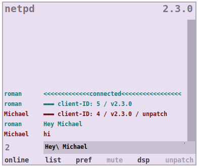

## chat

**chat** lets you talk to other netpd users. Click into the symbol box and type
your message.

### chat's user interface

*online* (resp. *offline*)
: indicates whether chat is connected to a server or not. Use it to connect or
disconnect. **chat** will automatically try to connect the configured
[server](../server) when started.

*list*
: prints a list of all connected peers. Each entry also indicated whether
the respective peer has [unpatch](../unpatch) active.

*pref*
: opens dialog window to configure your [netpd-preferences](../netpd-preferences).

*mute*
: mutes and unmutes chat sounds (a bing when peers join or leave and a  click
on new chat messages).

*dsp*
: turns on and off Pd's audio computation. You can use it to turn any sound off

*unpatch*
: launches the [unpatch](../unpatch) instrument manager, it toggles it on and off.
By closing [unpatch](../unpatch) you terminate the running session on your end.
That means all your instruments will be closed and their state lost.

### chat's command interface

**chat** supports a few commands for debugging and controlling [unpatch](../unpatch). They are
inspired from IRC commands: Messages starting with a `/` entered to the chat
input are interpreted as commands.

The following commands are supported:

`/help`
: print a list of all available commands.

`/debug from on`
: print incoming messages to Pd window.

`/debug from off`
: turn off printing incoming messages.

`/debug to on`
: print outgoing messages to Pd window.

`/debug to off`
: turn off printing outgoing messages.

`/unpatch start`
: start unpatch.

`/unpatch stop`
: stop unpatch.

`/unpatch protect on`
: turn on unpatch's protected mode. In this mode any interaction with peer's
unpatches is suppressed. This is useful when developing a new instrument.

`/unpatch protect off`
: turn off unpatch's protected mode.

