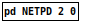
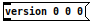
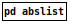
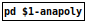
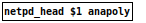
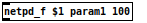
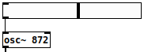
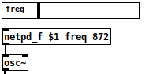
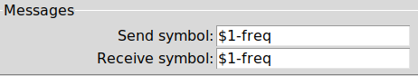

# [DRAFT]
## Instrument Creation

### What is an instrument?
In **netpd** terminology, an instrument is a [Pure Data](https://puredata.info)
patch that is loaded by the [unpatch](../unpatch) instrument manager. For a
patch to be used as **netpd** instrument, it needs to fullfill certain
properties which are described in this document. Mostly, you don't need to
understand the inner working of **netpd** in order to create your own
instrument or to convert an existing patch into an **netpd** instrument.
However, some more involved ideas might not be realized with ready-made
solutions and require a deeper understanding of the **netpd** framework to be
implemented. In such cases, it is advised to study existing instruments that
are similar or share some concepts. The typical cases, however, are covered
here.

Contrary to its name, an instrument doesn't necessarily produce any sound.
Also sequencers or graphics generators are considered instruments. Common
to all kinds of instruments is that they share their state among peers. The
controllable parameters are synchronized so that the result (sound,
sequence pattern, graphic) is the same on all participants' computers.
Whenever a parameter changes its value, the change is propagated through
the server to all peers. This ensures synchronicity throughout a session.
The origin of the parameter change doesn't matter. Any peer can modify
any parameter at any time and the resulting experience is the same for all
peers. Another property of instruments is that their state is managed.
When a peer joins an already ongoing session, they receive a full state dump
from their peers. This happens transparently and does not have to be
implemented for each instrument separately.

#### Features of instruments
- **Instruments use abstractions** for certain functions, such as state management
and parameter synchronization, and which are provided by **netpd**,  the so called
[netpd-abstractions](../netpd-abstractions).
- **Instruments are versioned.** [unpatch](../unpatch) uses the instrument version to
decide whether the instruments needs to be transferred to a peer or not. Instruments
are only transferred from the peer who initiated the loading of the instrument
to the other peers. If a receiving peer already has the instrument with the same
or higher version, this version of the instrument is kept and the transfer aborted.
- **Instruments can declare dependencies.** Dependencies are abstractions in Pure
Data jargon. Abstractions are re-usable parts that can be instantiated once or
many times in an instrument. The same abstraction can be used by many instruments.
Contrary to instruments, which are saved in `netpd/instruments`, abstractions
are saved in `netpd/instruments/abs`. Abstractions are also versioned and they
can also declare their dependencies. There is no limit to the nesting of
dependency declarations.
- **Instruments have a graphical user interface** which is displayed to the user
when clicking on the instrument's name in [unpatch](../unpatch). When an
instrument is used (as opposed to developed), the guts (the code required
for the instrument to work) are hidden.

While the declaration of dependencies is optional, the declaration of a version
is mandatory. This applies to both, instruments and their abstractions.

#### Natural habitat of instruments
Instruments work only when loaded by [unpatch](../unpatch). If you're
familiar with UNIX shells, think of it as [unpatch](../unpatch)  setting
some environment variables for the instrument to work properly. It tells the
instrument where to look for loading [netpd-abstractions](../netpd-abstractions)
and its own declared dependencies. Also, [unpatch](../unpatch) assigns a
unique ID to each instrument. This allows many instances of the same instrument
to be loaded in [unpatch](../unpatch). Loading an instrument in Pd directly
most likely triggers a bunch of `.. couldn't create` errors and the patch
fails to work as expected. Thus, also the development of a new (or existing)
instrument needs to happen while being loaded by [unpatch](../unpatch).

### Create it
#### Prepare your dev environment
Normally, [unpatch](../unpatch) would automatically transfer any open
instruments to other peers when they join the session and don't have a copy themselves.
Since you're going to start  developing your instrument, you might want to prevent
[unpatch](../unpatch) from doing so. You can enable protected mode (where
[unpatch](../unpatch) doesn't interact with other peers) by typing the following
to the [chat](../chat) text input:

```
/unpatch protect on
```

A small umbrella (☂) near the *unpatch* label indicates that [unpatch](../ubpatch)
is running in protected mode now nobody can (accidentally or willfully) close
it while you're developing it.

#### Find a name
[unpatch](../unpatch) helps you create a new instrument skeleton from scratch.
You just need to come up with a name for your new instrument. Ideally, the
name is easy to type, which makes it easier to load your instrument into
a session. It's established to use lower-case letters, numbers and dashes.

#### Deploy from template
If you know a name, launch [unpatch](../unpatch) and type the following into the
[unpatch](../unpatch)'s text input (slightly darker area in the center):

```
/new anapoly
```

A new instrument appears in [unpatch](../unpatch)'s lower section with the name
you specified (*anapoly* in our example). Click on it and an empty patch opens.
This is the subpatch where the new instrument's graphical user interface is going
to live. The more interesting part - the main patch - is still hidden. You can
access it through the menu _Window_ -> _Parent Window_.

**Tip**: This applies to all instruments. If you want to study how a certain
instrument works internally, go to its main patch through the _Window_ menu.

Now let's go through some of the elements of your new instrument that are part
of every instrument:

#### The core elements explained
##### - The metatags

This is the container for the so-called **netpd** metatags. When loading an instrument
with [unpatch](../unpatch), it will parse the content of this subpatch before
loading the instrument. The numbers `2 0` specify the the metatag format version.
Currently, **netpd** only supports this one version, so it is always `2 0`. If you click
on the object, it will show its contents in a new window.

There you find a message box
. Whenever you change your instrument, make sure to
bump the version to a higher value. Which one of the three numbers you bump, is up to
you. This tells [unpatch](../unpatch) to transfer your instrument to your peers, if
your version is higher than theirs. As said before, the `version` metatag is mandatory
and [unpatch](../unpatch) refuses to load your instrument with an error message if it
is missing.

The subpatch  is a container for the declarations of
the dependencies of your instrument. It opens another canvas when you click on it.
If your instruments uses abstractions, you would declare them there by putting
a message box like  for each abstraction.
Also, the abstractions of your instrument require a metatag declaration
() with at least a version.


##### - The GUI
This subpatch is displayed when you click on the instrument's name in
[unpatch](../unpatch). In other words: The content of this subpatch is what the users
see when using your instrument. You put everything what controls your instrument in
there: sliders, number boxes, radios, toggles, etc. Remember that also the window
position and size of this canvas is saved with your instrument. You might use the full
potential of your creativity to design a super-fancy GUI. Simple white default
size sliders work too, of course.

The `$1` is a variable set by [unpatch](../unpatch). It is evaluated to the ID, the
number shown near the instrument's name in [unpatch](../unpatch). This number is unique
among loaded instruments. The part after the `-` must be set to the instrument's name.
The combination (`3-anapoly` in our example) is also the title of the GUI window of your
instrument.

##### - The state manager
This abstraction is responsible for the communication with the other peers' copy
of your instrument. It also initiates full dumps when saving current state with
[unpatch](../unpatch)'s `save` button. Every instrument requires exactly one
`[netpd_head]`. The first argument is always `$1`. The second argument must be
set to the name of your instrument. The ID and the instrument name are
used in the OSC triggered when one of the controls of your
instruments is touched. `[netpd_head]` prepends `/3/anapoly` (ID, name) to the
OSC path of each OSC message generated by your instrument.

#### Control parameters of your instrument
Up until now, we've been discussing the boilerplate required for each instrument.
The interesting is part is to make sure all control parameters are handled by
**netpd** using the so-called [netpd-abstractions](../netpd-abstractions). Those
are the modules keeping the state of each parameter of your instrument
synchronized among peers. The different abstractions cover different
types of parameters, including numbers, symbols, lists, text, tables, or
audio samples. When all control parameters of your instrument are handled by an
instance of one of the [netpd-abstractions](netpd-abstractions), you have a fully
working **netpd** instrument that produces the same result for all joining peers
in a session. Common to all [netpd-abstractions](../netpd-abstractions)
is that they require the first argument to be `$1` and a unique (within your
instrument) name as second argument defining the parameter name. Some take
even more arguments. Read more about all the available
[netpd-abstractions](../netpd-abstractions).

To see how this works in detail, let's illustrate it with an example.

##### - A numeric parameter
Assume our instrument should control the frequency of an `[osc~ ]` object with
a horizontal slider, like this:



We convert that to a **netpd** parameter by using `[netpd_f]`:

 

`[netpd_f]` receives the values from the slider and sends it through
the network. When it receives a new value, it updates the slider position
and sends the value through it's outlet. Because there is no wire between
`[netpd_f]` and the slider, the message passing happens through send
and receive symbols. Make sure to set them accordingly in the properties
of the slider (see second image above).  Both, the send and receive are named
`$1-parametername`, or in our example `$1-freq`. When your instrument is loaded,
`[netpd_f]` initializes the slider and the `[osc~ ]` object to the value 872,
the third argument given to `[netpd_f]`.

Other GUI widgets provided by Pd can be hooked up to a `[netpd_f]` the same way:
  - `[vslider]`
  - `[hslider]`
  - `[vradio]`
  - `[hradio]`
  - `[tgl]`
  - `[nbx]`

We learned before that instruments separate their inner workings from the graphical
frontend. This means we can put the slider in the GUI subpatch and keep the `[netpd_f]`
in the normally hidden main patch. You can now apply the same process to all control
parameters of your instrument in order to turn them into **netpd** (or "**netpd**ized")
parameters. For all numeric parameters you would do it the exact same way as described
above.

##### Other types of parameters
For other types of parameters, you would try to figure out if there is already a
[netpd-abstraction](../netpd-abstractions) that covers the particular use case. If
there is, study it's help file for more detailed information about its
usage. If you fail to find anything that covers your use case, you can still
implement your own abstraction, theoretically. Practically, there is little
documentation about the inner working of *netpd*, thus you would need to figure
out how things work internally by studying the existing abstractions. Going more
into detail here would go beyond the scope of this document. The available
[netpd-abstractions](../docs/netpd-abstractions) cover the most common data types.
When designing instruments like synths or effect libraries, chances 

### Thoughts about instrument design
Different data types require different ways to interact with them. Still,
some principles apply to all types. Unlike in common Pure Data, where control
operations usually happen in zero logical time ("instantaneously"), control operations
in netpd suffer latency

Please note that operations
intended to change state are transmitted through the network before they
have any effect. Where in Pd most operations can be executed in zero logical time, state
changes take time in **netpd** due to network induced latency. The latency is variable
and increases with the (physical) distance between peers. 

