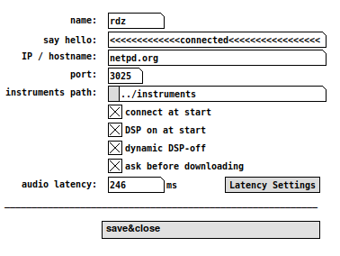

## netpd-preferences

### Configure netpd's default settings

name
: Set the nick name that is shown to your peers

say hello
: Your welcome message that is sent when [chat](../chat)
connects to the [server](../server).

IP / hostname
: IP address or hostname of the [server](../server) you
want to connect to. The default is `netpd.org`.

port
: Port of the server. The default is 3025.

instruments path
: Configures the directory where netpd looks for instruments.
This directory must contain a directory named `abs` where the
abstractions used by the instruments are stored. The default is
`~/netpd-instruments`. If this parameter hasn't been configured,
netpd asks to create that directory (and the `abs` directory
inside).

connect at start
: Configures whether netpd automatically connects to the
server at startup.

DSP on at start
: Configures whether DSP is automatically turned on at startup.
When DSP is off, Pd's audio computation is halted and all
audio outputs are silent.

dynamic DSP-off
: Configures whether DSP is turned of during operations that
are likely to trigger many DSP graph re-calculations. Operations like
loading instruments or effects in [mx] require Pd's DSP graph to be
recompiled, sometimes many times. This takes time and is often a cause
for audio drop-outs. Because netpd "knows" more about what it is going
to do than Pd, enabling this option minimizes drop-outs since DSP is
recompiled only once, when it is turned on again.  
**Note**: With certain audio backends Pd disconnects the audio card
when turning DSP off. With such backends, this option might have
adverse effects.

ask before downloading
: When enabled, **netpd** will display a confirmation dialog for every
instrument or abstraction that is downloaded from a peer. This reduces
the likeliness for someone else to overwrite your stuff. Also, it allows
you to decide yourself who you trust.

audio latency
: Configures audio latency (the time it takes for a signal to go from
soundcard input through Pd to soundcard output). When configured properly,
netpd can compensate for it. This compensation is used by some instruments
(like [evil](/instruments/evil) or [simplesample](/instruments/simplesample))
for properly aligning recorded audio with generated audio.

Latency Settings
: This opens another dialog with tools to find the correct audio latency.
You can either measure the actual latency by connecting a cable from audio
output to audio input. This is the most precise and reliable method, but
not always viable.  
Another method is to calculate an estimation of the audio latency by
entering some parameters of the currently used audio back-end (check
the `alsa` and `jack` buttons).

save&close
: Any modifications take effect immediately. However, the current configuration
is only saved when this button is clicked. The preferences are stored in
`~/.netpd.cnf`. This file is read by [chat](../chat) at startup.

