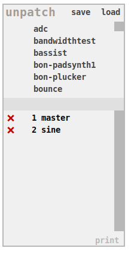

## unpatch

**unpatch** is the instrument manager. With it new instrument are loaded into the current session.
All connected peers have control over all instruments of a session. Anyone can load any instrument,
anyone can close any instrument.

### unpatch's user interface

save
: saves current state (with the state of each instrument in the session) to file

load
: loads a previously saved state from file into current session. Please mind that
this closes all instruments of the current session.

upper scroll list (available instruments)
: The upper scroll list lists all available instruments which are found in the directory
configured in *instruments path* in [netpd-preferences](../netpd-preferences). Instruments are
loaded into the current session by clicking on their name.

lower scroll list (active instruments)
: The lower sections shows all instruments currently in use. Each instrument gets a unique
ID assigned which allows to load many instances of the same instrument.

print
: When enabled, unpatch is printing information about up|down|loading and closing instruments
to Pd's console.

### unpatch's command interface

`/new <instrument>`
: create a new instrument from template. Replace `<instrument>` with the name of your new
instrument. The new instrument contains all the boilerplate required for a working instrument
and provides basic comment about the available [netpd-abstractions](../netpd-abstractions).
Read some more about [instrument creation](../instrument-creation).
