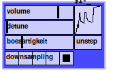

## bassist

bassist is a monophonic synthesizer based on the purest waveform, a sine.
With the 'boesartigkeit' slider you can adjust the curve on the right.
the more 'boesartigkeit' you give, the more will bassist sound like a
square wave (i think this is called waveshaping). you can also draw
the curve manually. This might sound like the bassist is playing on
a broken amp.  
With the 'detune' slider you can detune the pitches between the left
and the right oscillator (using this feature creates a
non-mono-compatible sound). No 'detune' is the default (slider fully on the left).

