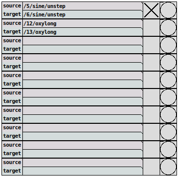

## cloner



This utility allows you to copy all or a subset of settings
from one instrument to another.

For example, to synchronise two instances of the lilacid synth loaded
into the 3rd and 4th slots of unpatch -  set source to `/3/lilacid` and
target to `/4/lilacid` by typing into the boxes and pressing enter.
Toggle continuous synch on and off by clicking the first box on the right.
The next box to the right can be used to trigger a sync refresh when
continuous updating is off. Moving a slider on *3-lilacid* will move the
corresponding slider on *4-lilacid*. The notes in the unstep sequencer
will also be shared.

You can also synchronize parts between instrument and the instruments
do not even have to be of the same kind, as long as the target understands
what the source sends.

#### Tip
You can learn about the OSC addresses of any parameter by printing
them out to the Pd console. You can do so by entering the following to
the [chat](/docs/chat) input:

```
/debug to on
```

Now every event causing an  OSC message is printed. To turn it off
again, simply do:

```
/debug to off
```

#### Example 1: Clone a full instrument
  * source: `/12/rtfm`
  * target: `/15/rtfm`

#### Example 2: Clone unstep to instrument of different kind
  * source: `/4/sine/unstep/sine1`
  * target: `/5/rtfm/unstep/rtfm2`

#### Example 3: Clone instrument's insert fx to aux effects (mx-slots in aux-4)
  * source: `/4/sine/insert`
  * source: `/6/mx/aux/4/insert/mx-slots/insert`
