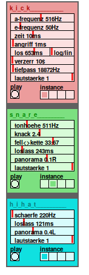

## drum-delta

A simple drum synthesizer with 3 sections:
- kick
- snare
- hihat

In each section you can edit four differents sounds. just select the instance
with the *instance*-radio.

Each section is monophonic. if you trigger *hihat1* and *hihat3* at the same time,
only the last triggered will be heard.

