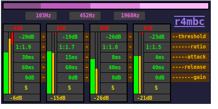
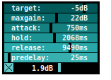
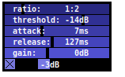
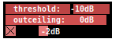

## dynlib

dynlib is a collection of dynamic processing effects. They are built to be used in
[mx](../mx) as insert effects.

---

#### r4mbc

**r4mbc** is a 4-band multi-band compressor. It uses 4th-order butterworth
filters for separating the bands. Each band then uses a downward compressor
as used in **rcomp**.

---

#### ragc

**ragc** is an automatic gain control meant to level the overall
gain of a full mix. It reacts slowly in order to create the notion of a
balanced gain while trying to be not noticable. It was originally developed
for broadcasting audio streams to the web (see [netpd-radio](/listen))
in order to deal with tracks with vastly different gains,
but it might be (ab-)used in netpd as well.

---

#### rcomp

**rcomp** is a downward compressor. Its control chain is processed in audio rate.
A meter and display can be enabled with the toggle.

---

#### rlimit

**rlimit** is a basic, but fast limiter. It is able to look ahead in
order to limit even very fast transients, which adds a latency of
88 samples (2ms @ 44.1 kHz). Lowering the threshold raises the gain
accordingly (that's how some brickwall limiters work). However,
the maximum output amplitude can be set by the out ceiling slider and
is never exceeded.
