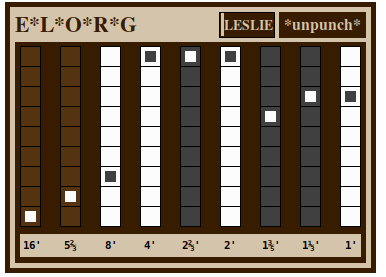

## elorg

**elorg** emulates an organ with 9 drawbars, each controlling
a partial tone. It supports polyphony up to 8 voices. The sum of all
voices is then routed through a simple leslie simulation.

**elorg** uses [unpunch](../unpunch) as sequencer.
