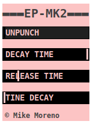

## ep-mk2

An emulation of an e-piano implemented by using physical modelling. The
instrument is a port of Mike Moreno's EP-MK2 from https://github.com/MikeMorenoDSP/EP-MK1.

**ep-mk2** uses [unpunch](../unpuch) for sequencing.
