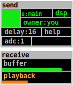

## evil

**evil** transmits live audio input to all connected clients. On the receiving
end, audio is played back with a pre-defined delay so that audio input
is musically aligned to the other instruments.

### Usage

For each loaded instance of  **evil**, there can only be one peer acting as
sender, while the transmitted stream is received by all peers, the
sender included. For becoming a sender, three conditions need to be met:

- the selected clock needs to be running
- DSP needs to be turned on
- ownership needs to be assigned to the sending peer

You can claim ownership by clicking *owner* in the gui. Once those conditions
are met, the *transmit* button (top left square) turns from black to dark green
to indicated readiness. Sending audio starts as soon as the *transmit* button is
pressed. A receiving stream is indicated by the green *buffer* progress bar
filling up. The orange *playback* bar displays the audio level of the received
audio. As long as the *transmit* button is green, the stream is running. The
streaming is stopped by clicking the *trasmit* button again.

### Some notes

#### Bandwidth

**evil** transmits one channel as 16bit PCM at Pd's current sampling rate. This
amounts to roughly 100 kB/s at 44.1 kHz each way. Since **evil** doesn't do
resampling, it's of utmost importance that all peers use the same sample rate.
**netpd**'s default sample rate is 44.1 kHz.

#### Congestion

**evil** makes sure that all peers receive the stream in time. If one peer
experiences a buffer underrun, it notifies the sender instance, which then
immediately stops transmitting.

#### Clock sync

When the sender clicks the transmit button, the current time tag (received from the
selected clock) is stored and the playback time is calculated from it (assuming
all values are given in tick units):

  current time + delay - audio latency = playback time

The playback time is then sent to all receiving peers.
This ensures that the playback of recorded audio is temporally correctly aligned to
the generated sound. This also means, that the clocks of all peers need to be (more
or less) in sync. If a receiving peer's clock is a few ticks ahead, their receive
buffer is less full when the clock hits the playback time, thus making buffer underruns
more likely. As stated above, a buffer underrun on any receiving peer causes the
whole transmission to stop. Thus, it is recommended to make sure before sending that
clocks are in sync. [untik](../untik) has automatic syncing enabled per default. However,
it should not perform any synchronization during **evil** transmissions. It is
recommended to turn 'auto' in the 'sync' section off.

#### Correct timing

**evil** tries to start playback exactly aligned to the sound generating instruments,
offset by the delay in the *delay* parameter. This only works correctly, if
the effective round-trip audio latency is configured correctly in
[netpd-preferences](/docs/netpd-preferences).

