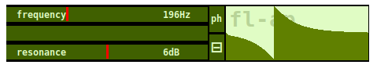
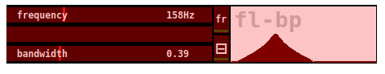
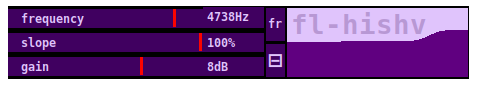
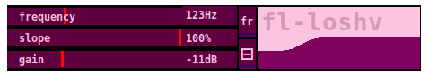
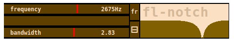
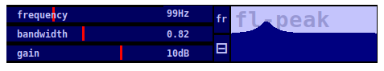
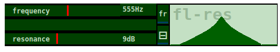
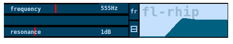
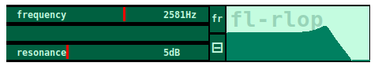

## filtlib

### fl-ap

all-pass filter

### fl-bp

band-pass filter

### fl-hishv

high-shelving filter

### fl-loshv

low-shelving filter

### fl-notch

notch filter

### fl-peak

peak filter

### fl-res

resonant filter

### fl-rhip

resonant high-pass filter

### fl-rlop

resonant low-pass filter

