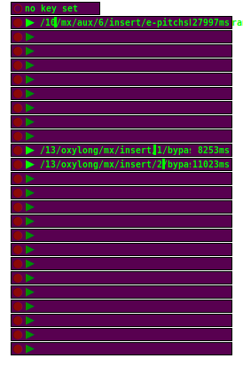

## latch2

**latch2**  records and plays back automation parameters. It records any
parameter of any instrument that consists of only one number. More
complex parameters are not supported.

Unlike [latch3](../latch3), the timing is not bound to the master clock. Changing
master tempo or switching master on and off doesn't influence automation
playback of **latch2**. Playback is running *freely*. This can be fun
sometimes, but it breaks netpd's goal of delivering the exact same result
on each client. If you mind that, use [latch3](../latch3).

### Usage

#### Recording

Click the record button (red circle) of any free latch instance to start
recording. This instance registers the name (OSC address) of the next
single-number parameter that is touched. Once an address is registered,
other parameters are ignored. Always ignored are parameters that are not
single-number (like symbols or lists). Hit record button again to stop
recording.

#### Playback

Once an automation has been recorded, it can be played back by clicking
the playback button (green triangle). Playback is stopped by clicking
the playback button again.

