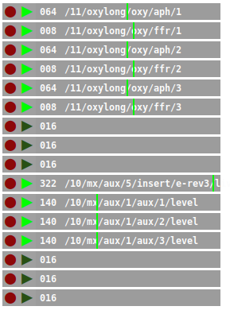

## latch3

**latch3** is another automation recorder similar to [latch2](latch2).
However, it is conceptually different from [latch2](latch2) in that its timing is
tightly coupled to [master](master). The duration of an automation is defined
prior to recording. Recording starts only at every n=length steps.
Events are recorded in relation to current master time, so changing
[master](master) tempo also affects playback of automation recordings. Also, it
is not limited to single-number parameters, but records any events
that share the same OSC address. This involves the danger of breaking
a session when not handled carefully. Due to the fact of being timing-wise
coupled to [master](master), **latch3** does not work without it.

### Usage

#### Recording

Before you record, set the desired length (with number that defaults to 16).
Then hit the record button (red circle). A pink cursor indicates the time
until actual recording starts. By touching any controller in netpd, you
might already set parameter to be recorded without recording a value yet.
As soon as the [master](master) clock reaches a multiple of the predefined length,
the actual recording starts and the cursor turns red. Changes to the parameter
are recorded now, until the length is reached and recording stops automatically.

#### Playback

Click the playback button (green triangle). Playback is looped indefinitely and
is coupled to the [master](master) clock. Stopping [master](master) also stops playback.
