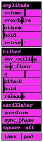

## lilacid

### Beware of the lilac poison!

**lilacid** is the challenger of the famous tb303 synthesizer. It is
a simple monophonic synth, which is triggered by the sequencer-abstraction
[unstep](../unstep). The oscillator section (switchable between
bandlimited square and saw) is followed by a peakfilter, whose frequency
and q are controlled by signals (built with only internals! have a look
at the ![peakfilter~]-abstraction, if you are interested to use it yourself).
The filter section in turn is followed by an overdrive section, which creates
that typical scratchy sound.

Many of the parameters can be automated by [unstep](../unstep)'s automation parameters, which
are recommended to be used in order to get the full potential of **lilacid**'s sound.

