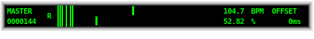

## master

**master** serves as the main clock for sequencers and the meta sequencer [metaseq](../metaseq).
It controls current "song" position and tempo. Tempo can be varied freely. The clock
is output as an integer number counting upwards. One step represents a 16th note if
we consider the beats in the BPM to be quarter notes. The clock itself is agnostic
of any measure.

### Usage

#### Start/stop

Start and stop master by clicking the left area.

#### Change tempo

Tempo is either changed by manipulating the tempo number display or moving the upper
slider in the middle section.

#### Shuffle

The amount of shuffle ranges between 50% and 75%. The percentage represent the duration
ratio between odd and even steps. 50% means odd and even steps have the same length.
66% means odd and even steps have a ratio of 2:1. 75% is similar to dotted notes.

### Polyrhythm

**master** provides an abstraction master-poly that converts the master clock to a clock
with an arbitrary integer number timing ratio. Some sequencers use that to create
polyrhythmic patterns. Unfortunately, there are conceptual problems with supporting
polyrhythmic patterns, thus support is still incomplete. It's also unclear how
shuffle and polyrhythms go along, thus shuffle is ignored when using master-poly.

