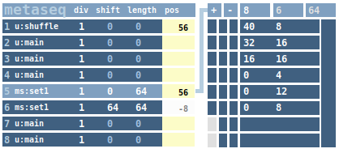

## metaseq

**NOTE** Above images show new version of **metaseq** that is compatible with
[untik](../untik/). However, the documentation below hasn't been (fully ) updated.

**metaseq** is a time-line slicer that acts as a middle man between the a linear main  clock
(like [untik](../untik)) and a
sequencer. It lets you arrange timeline segments freely in order to create more complex
sequencing structures. Such arrangements are organized in sets. Sets can be chained in
order to build even more complex structures. Since **metaseq** fully integrates into the
[untik](../untik) clock system, it is fully compatible with any existing sequencer.
**metaseq** sets are themselves untik clock consumers and at the same time clock providers
and thus can freely interact with each other.

### left-hand part: sets

There is a fixed number of eight sets available (yeah, the old pre-untik **metaseq** had
virutally infinite sets, which unfortunately was not possible with the new system anymore).
Each set provides the following parameters for editing:

clock selection
: choses any clock from the available clocks. This includes **metaseq** sets with a non-zero
number of segments.

div
: clock divider factor. Makes the input clock slower by an integer factor

shift
: shifts the set timing-wise to the right. This means the set starts playing only when the clock
reaches the value of shift.  
**Note**: The shift parameter has only an effect when length is non-zero. The slightly greyed out
color indicates when shift is not active.

length
: sets the length in ticks for which the set is played. When length is 0, the configured
sequences of the set (right-hand part) are looped indefinitely. If the length is greater
than length of the right-hand part (sum of sequences), the right-hand part is looped.

pos
: displays the curren tick position (taking div, shfit and length into accout). 

### right-hand part: segments

For a set to output anything at all, one or more segments need to exist for that set. 
Each set has its own group of segments. The segemnts of the highlighted set are
displayed on the right-hand side. To see the segments of a different set, simply click
on a different set on the left-hand side. 

Segments are added  with `|+|` and removed wit `|-|`. Each segment is defined by
two numbers, the segment offset and the segment length. There is no limit on the number
of segments per set. The segments define which part of the sequencer (or a chained set,
for that matter) is going to be played. The sum of all segment lengths is displayed in
the header row on the right. If the current set uses master as its input clock, the 
whole group of segments is looped indefinitely and the loop length equal to the 
sum of all segment lengths. 

The first column of buttons sets the range of the active segments. New segments
are added without affecting the playback of the current set. Only when the range
is adapted to include the new segments, the new segments are effectively used.
Note that only the range end and can be defined. The range starts always with the
first segment of the set.

The second column of buttons is used to solo specific segments. Only one segment
can be solo'd at a time. If a segment is solo'd, this segment is looped
indefinitely, disregarding all other segments as long as solo is active.

The third column of buttons mutes specific segments. The length of the segment
is still accounted for in the set, but no clock is output during playback
of a muted set.
