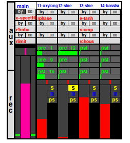
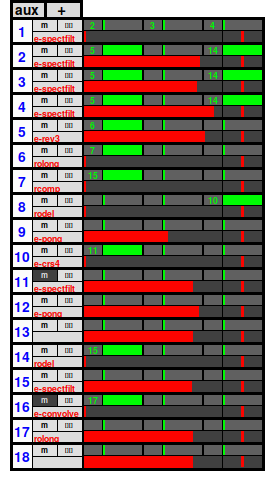
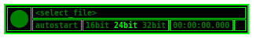

## mx

**mx** mixes all audio outputs from sound generating instruments and
provides a framework for using audio effects in netpd. Effects are organized
in libraries, which must be loaded as instrument in [unpatch](/docs/unpatch) before their
effects can be used in **mx**. Effects may be used as inserts or auxilary
channels. **mx** as of today works with stereo channels and also the mixdown
result ist stereo (two channels).

### Channel strip

Each instrument using the abstraction *i2mx* automatically creates a channel
strip in **mx** with the instance name of instrument labelled on top (click the
label to open the instrument).

#### Inserts

The light grey three slots are for loading effects as inserts
(ligh grey area).

#### Aux sends

The green sliders are auxilary sends. The number refers to  the aux channel the
the signal is sent to, the sliders control the send amount. *pst* can be toggled
to *pre* and back to *pst*. *pst* means post fader, which means the signal after
panorama and level is sent to the aux channel. *pre* means pre fader, which
means the signal sent to the aux channel is tapped before the level and pan
controls.

#### Mixing control

The red horizontal slider is the panorama control, the bigger red vertical one
controls the level sent to the main mix. *s* is solo, *m* is mute, and *ps* is
private solo. Private solo acts only locally and is not propagated through netpd,
thus does not affect peers.

#### Main output

The pink slider on the left controls the output volume. **mx** is hard-coded to use
adc 1 + 2 of Pd. It also features a section with 3 slots for insert effects.

### Aux section

The aux section is displayed by clicking the *aux* label on the very left in the
main window. Aux channels are created dynamically by clicking `|+|` in the aux
channel. Each aux channels features a slot for an effect and three pre-fader
sends that send the signal to higher number aux channels. This "downwards"
restriction prevents feedback loops and ensures that no additional latency
is added to the signal.

#### Recorder

The recorder is launched by clicking on the *rec* label in the main section.
It records the output (post-main-fader) of **mx** to a wav file with Pd's current
samplerate and a bitrate format of 16, 24, or 32bit-float. Since the recording
happens inside Pd, any glitches caused by audio drop-outs and similar are
eliminated in the resulting wav file.

