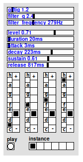

## oxygen

Original description:

> I am not able to say, what oxygen exactly is. The core of the code is a failed
> attempt to make a saw-waveform in pd.  
> oxygen is pseudo-polyphonic somehow. It plays chords consisting of four single tones.
> But the concept is not to control every tone separately, but to have six instances.
> In each instance you can change all settings independently from the other instances.
> Like this you can create six completely different sounds. Of course you only can
> trigger one instance at the time.  
>   
> With the first three sliders you can manipulate the timbre of the sound. The next
> group of sliders controls the amplitude envelope. When *duration* time elapsed,
> then *release* takes action.  
>   
> In the next section you set the pitches of the four oscillators, for each oscillator
> one radio to set the tone, one to set the octave. There is no possibility to mute a tone yet.

**oxygen** is sequenced by [qseq3](../qseq3).
