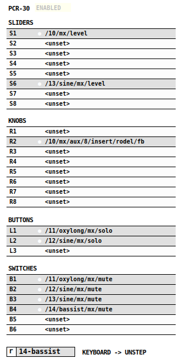

## pcr-30

**pcr-30** connects a hardware or virtual MIDI controller to netpd. The instrument
shown here uses a layout fitting the *Roland PCR-30* MIDI keyboard, but
other MIDI gear could be hooked up as well.

The controls respond to the following CC (control change) messages on MIDI Channel 1:
- **S1 - S8**: CC1 - CC8
- **R1 - R8**: CC9 - CC16
- **L1 - L3**: CC17 - CC19
- **B1 - B6**: CC25 - CC30

Make sure that the correct `MIDI In` has been set in Pure Data's preferences.

Incoming CC streams are mapped to netpd parameters by learning. Put the
controller you want to create a mapping for into learning mode by clicking it.
Then touch the netpd parameter to establish the mapping. The OSC address
of the parameter will appear in the controller. Once the mapping is established,
incoming CC messages directly control the mapped netpd-parameter.

Note that only single-number parameters with range of 0-1 can be used.
Incoming control change messages (0-127) are scaled to 0-1.

### Concurrency
In order to allow its state to saved like other netpd instruments, the state of
**pcr-30** is synchronized between peers. However, this might be undesired when
peers prefer to use their own independent mapping. Thus, **pcr-30** can be locally
disabled (see button on the top), so that each peer might use their dedicated
instance with their own mapping.

### Bridge to unstep
The selector at the bottom sets an [unstep](unstep) instance where
incoming MIDI notes are sent to. This allows any instrument that uses [unstep](unstep)
to be played live with a keyboard. **Note**: notes are only heard locally. The
button labelled `r` enables the recording of incoming notes to the selected
[unstep](unstep) instance.
