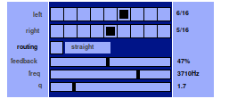
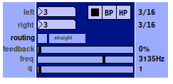
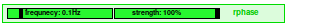
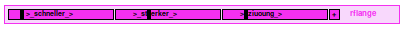
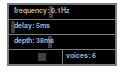
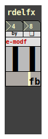

## rfxlib

### rodel

**rodel** is a stereo delay with a bandpass filtered feedback line that creates
a "dubby" feel. Routing of feedback lines can be switched between *straight* and
*crossed* (L → R, R → L).

### rolong

**rolong** is similar to **rodel** but allows for much longer delay lines. Also,
rolongs delay lengths aren't restricted to an integer of ticks. The filter can be
switched between low-pass, band-pass, and high-pass.

### rphase

**rphase** is a phaser with modulation frequency and strength.

### rflang

**rflange** is a flanger with modulation frequency, modulation amplitude and
feedback amount.

### rchous

**rchous** is a chorus effect with modulation frequency, delay, modulation depth, and
number of voices.

### rdelfx

**rdelfx** is a stereo delay with an effect insert in the feedback line. The delay
length, the amount of feedback and the feedback routing are controllable.

