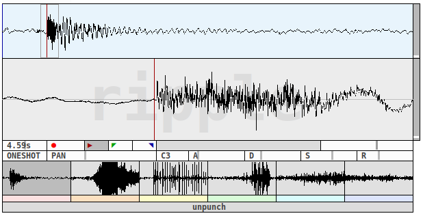

## ripple

**ripple** has 6 different slots for recording audio samples (duration: 1-20s)
that are played back in different modes. Each slot has its own set of parameters
that control how the sample is being played back. **ripple** records in stereo.
For each recorded sample, three cue points can be defined. The top part displays the
full waveform where a segment for more detailed inspection can be selected. The
lower display  shows the currently selected segment. In this part cue points are set.
For higher precision, the segment can be zoomed horizontally and vertically. The cue
points and the selected mode define what parts are played back.
Below the controls is an overview of all six slots. The controls above are applied
only to the currently selected slot.
[unpunch](../unpunch)'s *gid* property of notes corresponds with slots.

### Controls

#### First row

- recording duration
- record button
- first cue point
- second cue point
- third cue point
- horizontal zoom

#### Second row

- mode selector (available modes: *NORMAL*, *ONESHOT*, *LOOP*)
- panorama
- original pitch for pitch adjustment
- attack (amplitude envelope)
- decay (amplitude envelope)
- sustain (amplitude envelope)
- release (amplitude envelope)

### Modes

#### NORMAL

Normal mode uses all three cue points. On a note-on event, playback starts from
cue point 1. Then the part between cues 2 and 3 is looped as long as the note
is sustained. On a note-off event, the current position is played back to the
end of the sample.

#### ONESHOT

On a note-on event, the playback starts from cue 1 and continues to the end of
the sample. Perceived note length is still affected by the envelope generator,
while maximum length is limited by sample length.
Cue points 2 and 3 are ignored in this mode.

#### LOOP

From note-on to the fading out of the amplitude envelope control after a note-off
event, only the segment between cue points 2 and 3 is looped. 
Cue point 1 is ignored.

