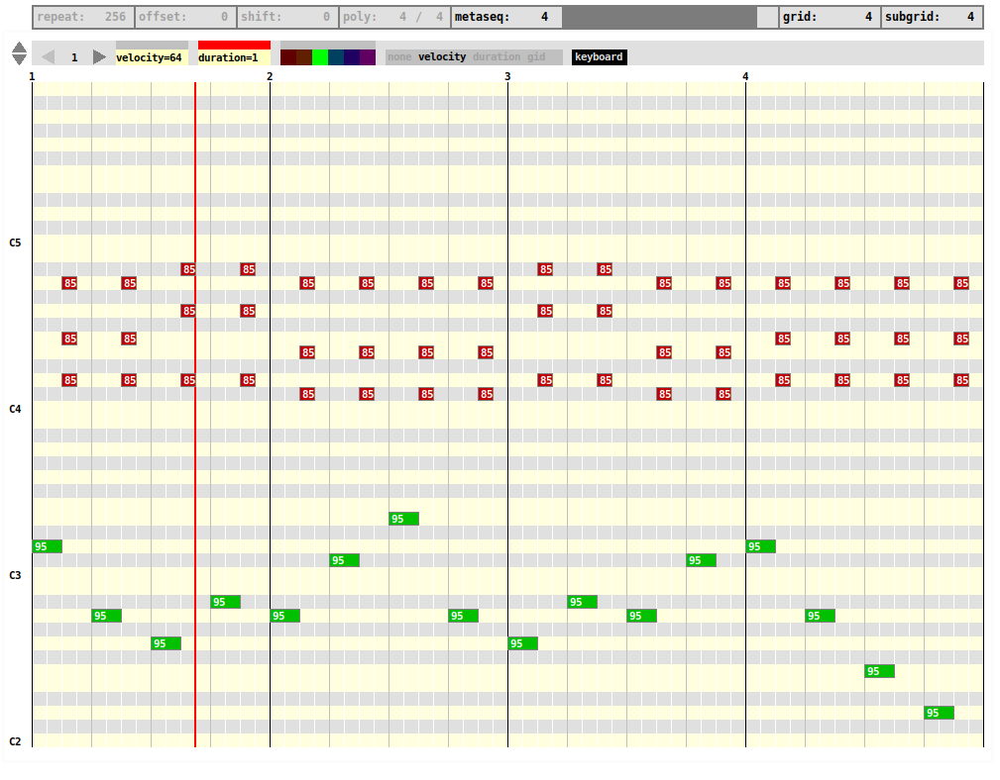

## unpunch

**unpunch** is the most recent (and probably the most advanced) note
sequencer in netpd. It  is similar to many  MIDI-style piano
roll sequencers that you might already know. Yet, it is the only note
sequencer in netpd that supports note duration and velocity.

Its main features are:
- editing with mouse actions and modifier keys
- editing with key commands
- copy&paste one or a group of notes
- editing a group of notes simultaneously
- navigation with key commands

### Editing

#### Note creation and deletion

- *Click* (on emtpy space): create a note
- *Double click* (on note): delete a note
- *Ctrl_L* + *Click* (on note): delete note

**Note**: Defaults are set in top section (velocity, duration, gid)

#### Note manipulation

- Drag right end of note: change duration
- Switch property selector in top section to *velocity*, *duration*, or *gid*.
  Value appears as number on each note. Numbers can be manipulated.

#### Note selection

- *Shift_L* + *Click* (on note): toggle selection
- *Shift_L* + (*Click*, *Click*) (twice on empty space): mark a region to
  select all notes within region.

**Note**: Marking many regions adds notes to selection instead of replacing
  current selection.

##### Note selection manipulation

- *ArrowKey*: Move selection to given direction
- *Shift_L* + *ArrowKey*: Increase step size to 1 octave, 1 bar respectively.
- *Ctrl_L* + *ArrowKey*: Make a copy while moving selection
- *Del*: Delete selected notes
- *Esc*: Unselect all selected notes

**Note**: Key commands require `keyboard` to be toggled on

Toggle the grey bar above any default selector (*velocity*, *duration*, *gid*)
to red. Subsequent default changes are applied immediately to whole selection

#### Navigation

- *PgUp* / *PgDn*: switch view by one page
- *Shift_L* + *PgUp* / *PgDn*: switch view by one octave

#### Keyboard toggle

When using keyboard, key events are received when any Pd window has grab. In
order to avoid unwanted edits and to allow many instances of unpunch, the
keyboard toggle makes sure that at most one instance receives key events.

