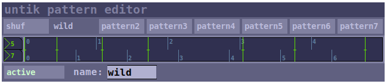
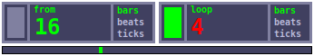

## untik

**untik** provides a clock for clock consumers like sequencers, etc. It is an
evolution of the previous standard clock instrument [master](../master/) as
it extends the notion of what a clock does and is.

### bars, beats, ticks
Besides ticks, it divides time in divisions ("bars") and subdivisions ("beats").
This allows clock consumers to express time intervals in more human-friendly
formats (e.g. 16 bars is easier to deal with than 256 ticks).

### time patterns
Beside the typical ticks with a steady time interval, **untik** allows you
to create time patterns with irregular time intervals and with adjustable
number of ticks per settable number of regular ticks (of the main clock).
**untik** plays all active patterns in sync and clock consumers may pick one.
You can have instruments play ternary rhythms while other instruments play
quaternary rhythms at the same time. You can create a simple 4-tick pattern
where the fourth tick is a tad bit late. Time patterns offer a lot of
possibilities and are much more versatile than the shuffle parameter and
the poly implementation of [master](../master/).

### unified interface
**untik** is not only a new clock, it is a clock system with a unified
interface for clock consumers and clock providers. Since **untik** offers
many clocks to pick from (if you activate and edit time patterns), clock
consumers need a way to select one. This is handled with a single abstraction
called `[untik-clock-consumer]`. It makes it really easy to integrate your
clock consuming instrument into the **untik** system. There is also
`[untik-clock-provider]` for instruments that generate their own clock
and want it to make available to clock consumers.

### main section

start/stop (square on the left)
: starts and stops the clock.

bpm
: sets the speed in beats per minute.

beats
: defines how many beats a bar consists of.

ticks
: defines how many ticks a beat consists of. This also affects the tick rate
for a given tempo. The more ticks the higher the rate so that the higher number
of ticks fits into the same beat length.

pos
: displays the current clock position (with zero-based counting)

bar
: displays the current bar (with one-based counting). A bar is beats\*ticks long.

beat
: displays the current beat within a bar (with one-based counting).
A beat is tick\*ticks long.

tick
: displays the current tick within a beat (with one-based counting).

sync delay
: displays the the sync delay to the peer with the most advanced clock. When
`auto`is enabled, delays above 300ms trigger a sync adjustment, which means that
our clock jumps forward to compensate for the delay. Whenever this happens, a
message is printed to the Pd console. The sync delay is never negative as
by definition the most advanced clock among peers is the reference time. With
auto syncing disabled, you can still compensate the delay by clicking on the
number. `ms` / `ticks` defines whether the measured delay is shown in clock ticks
or in milliseconds.

pattern editor
: opens another window that hosts the pattern editor.

loop editor
: opens another window that hosts the loop editor.

### pattern editor

A time pattern is a series of ticks with editable time intervals. A time pattern is
defined by its length - measured in regular ticks of the main clock, the
number of ticks played within this time frame, and the exact position of each tick.
Time patterns are repeated indefinitely and played back parallel to the main clock
and thus each pattern constitutes its own clock.

pattern selection (top row of buttons)
: selects a pattern to be edited. There are 8 patterns available. The button labels
reflect the name given to the pattern.

pattern editing (middle section)
: modifies the selected time pattern. The upper number on the left defines the
length of the pattern (measured in regular ticks of the main clock), while the lower
number sets the number of ticks. Each tick is represented by a green vertical line
that can be moved around horizontally (grab it in the middle). The distance between
two subsequent lines defines the time interval between those ticks.  Whenever the
numbers on the left are changed, the ticks are spread evenly over the pattern. For
instance, a 3 - 7 pattern means that 7 ticks are played during the time of three
regular ticks. This is similar to what could be achieved with the poly settings
in master. However, in the pattern editor each tick can be moved around freely,
which allows for much more rhythmical complexity and nuance. The number labels
on the top show where regular ticks (from main clock) would be, while the number
labels on the bottom show the even distribution of pattern ticks.

pattern properties (bottom section)
: sets some properties of the selected pattern, namely whether the pattern is active and
the name of the pattern. Inactive patterns are not listed in the list of available
clocks. Giving a pattern a meaningful name, makes it easier for instruments to pick
the right clock source.

**NOTE**: Before you can edit a pattern, you need to activate it first.

### loop editor

enable 'start from'
: (left rectangle) controls how untik starts. With it disabled, untik starts from
current position. With this enabled, untik starts from the position defined in
'from'.

from
: sets the start position. For this to have an effect, at least one of the two
rectangles ('start from' and/or 'enable loop') needs to be enabled. If looping
is enabled, it sets the start position for the loop. If 'start from' is enabled,
it sets the position for when untik is started the next time. The 'from' position
can be set in bars, beats, or ticks.

enable 'loop'
: enables looping. When enabled during playback, the clock position jumps
imeediately to the corresponding position within the time frame defined by 'from'
and 'loop' (actually, length of loop).

loop
: sets the loop length, either in bars, beats, or ticks.

### usage in clock consumers
All instruments requiring clock information use a drop-down menu listing all
available clocks. The **untik** clock systems isn't restricted to clocks from untik, but
any clocks are listed. Clocks are listed with a short-code prefix from the provider.

###### List of short-codes:
- `u` <- `untik`
- `m` <-  `master`
- `ms` <- `metaseq`

