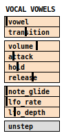

## voc

Vowel/formant synth that uses [unstep](../unstep) as a sequencer.

### Controls:

**vowel**
: selects a vowel sound (a,e,i,o,u).

**transition**
: adjusts the time it takes for the vowel to change smoothly.

**volume**, **attack**, **hold**, **release**
: control the amplitude envelope.

**note glide**
: controls the time it takes for the pitch to change from one note to the next.

**lfo rate** and **lfo depth**
: adjust a low frequency 'wobble' or vibrato effect applied to the pitch.

**unstep**
: opens the sequencer. At the bottom of the unstep sequencer panel are controls for sequencing changes to some of the controls above. 
