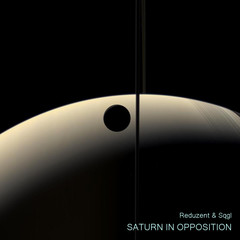
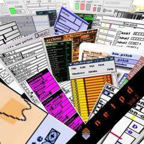
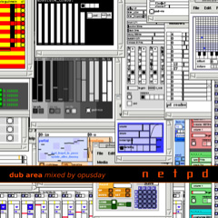

## recorded sessions
browse [mp3-records](/sessions/?C=N;O=D) of music created using netpd.

---

## netpd-radio

All recorded sessions (see link above) are played in shuffle mode.

[netpd-radio.m3u](netpd-radio.m3u) *← open this in your favorite player*

<audio controls="true" preload="none">
  <source src="https://radio.netpd.org:8443/netpd.mp3" type="audio/mp3">
        Your browser does not support the audio element.
</audio>

---

## compilations and mixes

  

**[Saturn In Opposition](saturn-in-opposition)**  
*by Reduzent & Sqgl*  
2017

---

  

**[netpd (Vol. 2)](netpd-vol-2)**  
*butchered by eni*  
2007

---

  

**[dub area (Vol. 1)](dub-area-vol-1)**  
*mixed by opusday*  
2006

