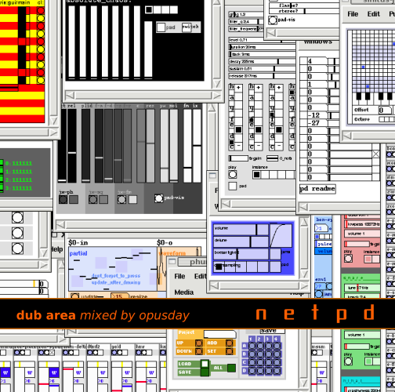

<h1>[netpd-cd1] dub area</h1>

<table>
<tr>
<td></td>
<td>
<h3>Tracklist:</h3> 
01 <b>anfang februar</b></li> 
02 <b>backup blues</b></li> 
03 <b>r_egosession2</b></li> 
04 <b>samuels 2te session</b></li> 
05 <b>samuels 2te session</b></li> 
06 <b>50cm schnee</b></li> 
07 <b>netpd@synapse radio kanal k</b></li> 
08 <b>samrom snm1</b></li> 
09 <b>samrom snm1</b></li> 
10 <b>aaah, i'm so stupid that i crashed this one!</b></li> 
11 <b>---------------</b></li> 
12 <b>groar</b></li> 
</td></tr></table>

 
 
<h2>download (create your own cd)</h2>

<h3>mp3 (all tracks in a single file)</h3>
<a href="/~roman/netpd-cd1/netpd-cd1_dub_area.mp3">netpd-cd1_dub_area.mp3</a> (73MB)

<h3>wav-files in a zip</h3>
<a href="/~roman/netpd-cd1/netpd-cd1_dub_area.zip">netpd-cd1_dub_area.zip</a> (648MB)

<h3>cd-cover (front and back) as tif</h3>
<a href="/~roman/netpd-cd1/netpd-cd1_dub_area_frontcover.tiff">netpd-cd1_dub_area_frontcover.tiff</a>  (100kB) 
<a href="/~roman/netpd-cd1/netpd-cd1_dub_area_backcover.tiff">netpd-cd1_dub_area_backcover.tiff</a> (185kB)
 
 

<h3>notes</h3>
the compilation was mixed using final scratch playing mostly mp3-files (not the original wav-files). due to that fact and that netpd generally sounds glitchy and scratchy sometimes, the sound quality of this compilation is not always the best.

