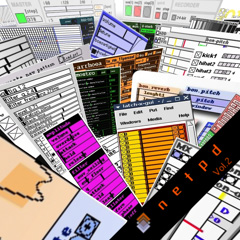

## recorded sessions

A non-exhaustive list of collections of music people made with netpd:

  * Some [mp3-records](/sessions/?C=N;O=D) from the beginnings to today
  * [2023 Archive](https://archive.org/details/fishcrystals-produces-netpdz-greatest-soup-recipes-live-2023-320kmp3/) by _fishcrystals_
  * [2024 Archive](https://archive.org/details/netpd-oh-24/) by _fishcrystals_
  * Some [unsounds](https://soundcloud.com/unsounds-netpd) made by _b2g_ and _beem_

---

## preset files

Collection of netpd saved states that can be loaded by [unpatch](../docs/unpatch).

**NOTE**: A saved state might load only correctly with the netpd and instrument
version of the time it was created.

  * _rdz_'s collection of [preset files](/~roman/presets/)

---

## netpd-radio

All recorded sessions (from first link above) are played in shuffle mode.

{}

[netpd-radio.m3u](netpd-radio.m3u) *← open this in your favorite player*

---

## compilations and mixes

  

**[Saturn In Opposition](saturn-in-opposition)**  
*by Reduzent & Sqgl*  
2017

---

  

**[netpd (Vol. 2)](netpd-vol-2)**  
*butchered by eni*  
2007

---

  

**[dub area (Vol. 1)](dub-area-vol-1)**  
*mixed by opusday*  
2006

