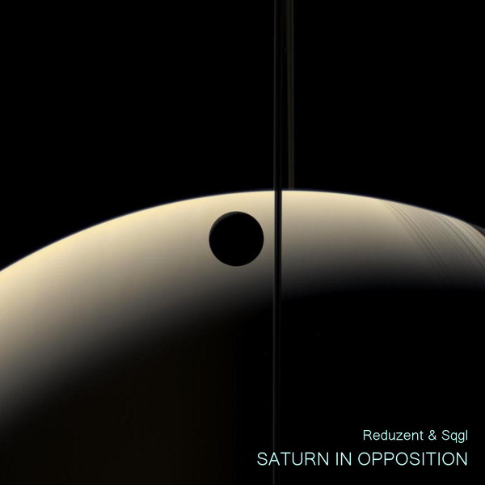

# Saturn In Opposition

*by Reduzent & Sqgl*  
*2017*

### Tracklist:

01 - RTFM phase (Tribute to Steve Reich) - *16:29*  
02 - Bachocor (Tribute to Max Corbacho) - *8:38*  
03 - Let it die first - *6:43*  
04 - Antipsyclone - *12:29*  
05 - Prebirth (Tribute to Lynn) - *7:34*  
06 - BOCCC (Tribute to Boards of Canada) - *8:07*  
07 - Rousseau Bureau - *8:39*  
08 - Konvex - *9:53*  
09 - Not quite Keadz - *9:43*  

### Get it:

  * [FLAC](/~roman/tracks/Reduzent%20&%20Sqgl%20-%20Saturn%20In%20Opposition(flac).zip) (405 MB)
  * [MP3](/~roman/tracks/Reduzent%20&%20Sqgl%20-%20Saturn%20In%20Opposition%20(mp3).zip) (138 MB)
  * Listen on [SoundCloud](https://soundcloud.com/reduzent/sets/saturn-in-opposition)

